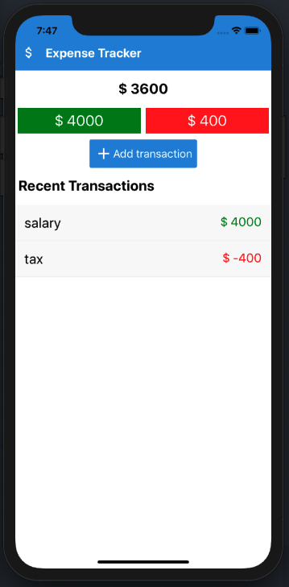
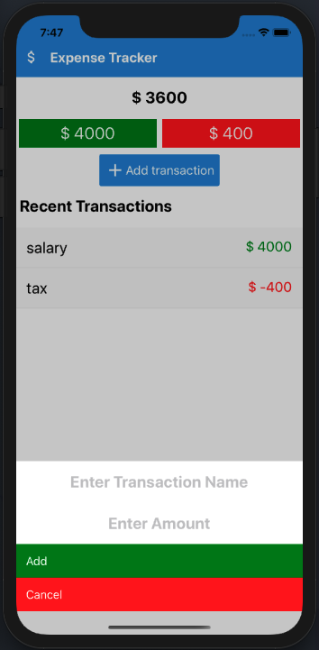

<h2 align="center">
React Native Expense Tracker App
</h2>

<h4 align="center">
Available for both iOS and Android.
</h4>

<br>

<p align="center">
   <a href="https://github.com/arunagnz/slam-book/blob/master/LICENSE">
      
   </a>
   <a href="https://github.com/arunagnz/slam-book/actions/new">
      
   </a>
   <a href="https://github.com/arunagnz/slam-book/issues">
      
   </a>
   <a href="https://github.com/arunagnz/slam-book/pulls">
      
   </a>
</p>

## Demo

<p align="center">
   
   
</p>

## Quick Start

```bash
# Install dependencies
npm install
cd ios && pod install && cd ..

# Link resources
react-native link

# Run on iOS
react-native run-ios

# Run on Android
react-native run-android

```
